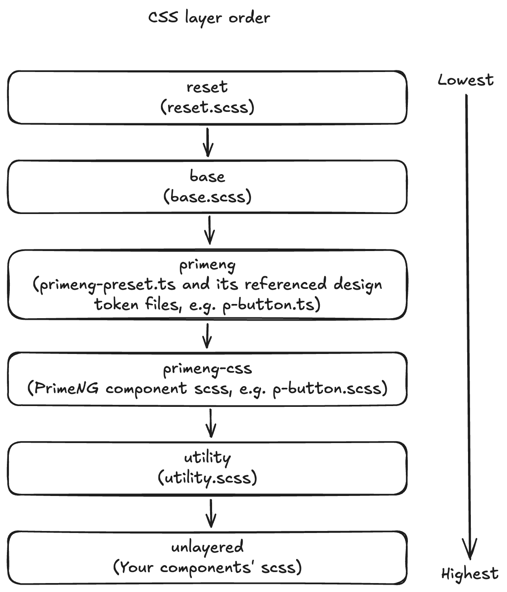

# CSS strategy

## Context

In web development, CSS can easily get messed up if no strategies/principles are applied. We should have a clear strategy on how to arrange CSS styles and implement them in a consistent manner.

## Decision

- We follow a consistent approach to decide where to put different types of styles
- We use [CSS layers](https://developer.mozilla.org/en-US/docs/Web/CSS/Reference/At-rules/@layer) to control the priorities of different types of styles

## Implementation

#### Decide where to put styles

Styles can roughly been split into the following categories:

- Styles applied to or shared by the whole application
- Styles for customizing PrimeNG components
- Styles that are specific to your own components

Styles are placed in the following places:

- Your components' own CSS files: These files reside adjacent to your components' class files, such as `icon.component.scss` for `app-cion`
- The `src/style` folder: Contains styles that are global or shared, with the following files:
  - `reset.scss`: Contains global styles for [CSS reset](https://meyerweb.com/eric/tools/css/reset/), normally you don't touch this file
  - `base.scss`: Contains globally applied styles and CSS variables
  - `utility.scss`: Contains utility styles that can be shared/referenced by the whole application
  - `primeng/primeng-preset.ts`: This is the PrimeNG preset which serves as the entry file for all customized PrimeNG design tokens using [PrimeNG's theming mechanism](https://primeng.org/theming), normally you don't touch this file
  - `primeng/primeng-primitive.ts`: Contains PrimeNG primitive design tokens, normally you don't touch this file
  - `primeng/primeng-semantic.ts`: Contains PrimeNG sematic design tokens that apply to all PrimeNG components
  - `primeng/primeng-components.ts`: Contains PrimeNG component level design tokens for individual PrimeNG component
  - `primeng/primeng-override.scss`: This file contains you own CSS styles for overriding PrimeNG components if you cannot implement your customization using PrimeNG design tokens
  - Folders for individual PrimeNG component(e.g. `p-button`):
    - `p-button.ts`: Design tokens customization for individual PrimeNG component, should be prefered over `p-button.scss`
    - `p-button.scss`: CSS overriding for individual PrimeNG component

When you try to add CSS styles, go through the following steps to decide where to put the styles. The red boxes are the
key decision points. There are multiple files related to PrimeNG customization, pay attention to the their applying
order. Basically, for customizing PrimeNG components, first use PrimeNG's built-in theming(design token) mechanism, only if
that fails should you add your CSS overrides.


#### How to customize `primeng-override.scss`

When customizing PrimeNG, sometimes you want to introduce some global styles, but you fail to do so using design tokens(`primeng-preset.ts`), this is when you should put your styles in `primeng-override.scss`.

1. First you should try target PrimeNG's built-in CSS selector, for example in `p-button.scss` we use `.p-button-icon-only` which is a PrimeNG built-in selector.
2. Only if you cannot find a suitable PrimeNG built-in CSS selector should you introduce your own CSS selectors, do prefix your own selectors with `pa-` which means "PrimeNG Assist". For example in `p-dynamicdialog.scss` we introduced `.pa-dialog-footer` for targeting footers that reside inside PrimeNG's [dynamic dialog](https://primeng.org/dynamicdialog), this `.pa-dialog-footer` is used to globally customize dialog footer in our own specific way. Also, you need to add this `.pa-dialog-footer` inside your component's HTML template(e.g. `demo-dialog.component.html`) in order for the selector to take effect.

#### Examples for where to put different types of styles

- For setting `font-family` of the whole application, this is the base style which applies to the whole application, and it's not just a PrimeNG concern, so the setting should be done in `base.scss`:
  ```
   body {
     font-family: 'Arial', 'Helvetica', 'PingFang SC', 'Hiragino Sans GB', 'Microsoft YaHei', '微软雅黑', 'WenQuanYi Micro Hei'
   }
  ```

- For setting a uniform padding for form fields, this applies to all PrimeNG form controls but not individual ones, so this should be configured in `primeng-semantic.ts`:
  ```
  formField: {
    paddingX: '0.75rem',
    paddingY: 'var(--medium-control-padding-y)',
  }
  ```

- For setting uniform font weight for PrimeNG buttons, PrimeNG has a built-in design token (`button.root.label.fontWeight`) for this. The customization should go inside `p-button.ts`:
  ```
  export const button: ButtonDesignTokens = {
    root: {
      label: {
        fontWeight: '500',
      },
    },
  }
  ```

- For setting pure icon `<p-button>`'s width and height to be the same size, this cannot be done by configuring PrimeNG's design tokens, so we need to do this inside the p-button's own overriding CSS file `p-button.scss`:
  ```
  // pure icon button
  button.p-button.p-button-icon-only {
    width: var(--medium-control-height);
    height: var(--medium-control-height);
    padding: 0;
  }
  ```

- For using our own footer inside PrimeNG's [dynamic dialog](https://primeng.org/dynamicdialog), we need a CSS selector to target the footer and apply its styles in a single place. So we introduced the `.pa-dialog-footer` selector and put it side `p-dynamicdialog.scss`: 
  ```
  @layer primeng-override {
    p-dynamicdialog {
      .p-dialog-content {
        .pa-dialog-footer {
          padding: var(--10px) var(--dialog-horizontal-padding);
          // ...
        }
      }
    }
  }
  ```

#### CSS layers

In practice, you don't quite need to touch css layers as they are already put in place for you. But a good understanding of the different layers' priority rules helps you better understand what's going on under the hood if you encounter some wired CSS issues.

The common principle for arranging css layers is: default global styles should be put as the lowest, followed by 3rd party components libraries(such as PrimeNG), and your own component's styles(which are unlayered) should be of the highest priority.

There are 6 CSS layers, from the lowest priority to the highest priority:

1. `reset`: CSS reset, used only in `reset.scss`
2. `base`: Base global styles and variables, used only in `base.scss`
3. `primeng`: PrimeNG design tokens fall into this layer, such as `primeng-preset.ts`, `primeng-primitive.ts`, `primeng-semantic.ts` and `primeng-components.ts`. Other customization files, such as `primeng-override.scss`, do not belong to this layer but `primeng-override` layer
4. `primeng-override`: CSS styles for overriding PrimeNG components' styles if design tokens failed to meet our requirements
5. `utility`: Utility styles, used only in `utility.scss`
6. unlayered: Your own components' styles



The CSS layers priority is configured by `theme.options.cssLayer.order` in `main.config.ts`:

```typescript
    providePrimeNG({
  theme: {
    preset: preset,
    options: {
      cssLayer: {
        name: 'primeng',
        order: 'reset, base, primeng, primeng-override, utility',
      },
    },
  },
}),
```
